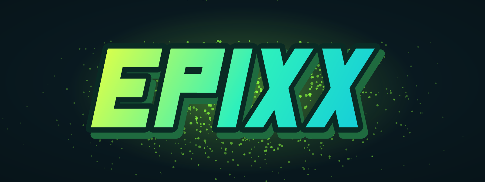

---
hide:
  - navigation
  - toc
---

# Epixx Scripts { .visually-hidden style="position:absolute;left:-9999px" }

Resources for <a href="https://qbox-project.github.io/">Qbox</a> servers, built on the ox stack. 
Developed in the open — documented here, supported on Discord.

<a class="md-button md-button--primary" href="#the-scripts">Browse the scripts</a>
<a class="md-button" href="https://discord.gg/2PjtpqdQXP">Join the Discord</a>
<a class="md-button" href="https://github.com/Epixx1337">GitHub</a>

## The scripts

  <a class="epixx-card" href="qbx_properties/">
    
🏠

    
qbx_properties

    
Player housing: apartments, shells and real MLO houses with an in-game realtor job, furniture editor, property market, rent, utilities and police raids.

  </a>
  <a class="epixx-card" href="qbx_appearance/">
    
👔

    
qbx_appearance

    
Appearance system and full illenium-appearance replacement — collection-native storage that survives game updates, screenshot studio, tattoos, outfits.

  </a>
  <a class="epixx-card" href="qbx_skills/">
    
🌳

    
qbx_skills

    
Skill tree progression: specializations, talent points, a live in-game tree editor and stat perks your other scripts query through exports.

  </a>
  <a class="epixx-card" href="qbx_propplacer/">
    
💡

    
qbx_propplacer

    
Scene creator: type a word, place it as a real 3D sign, light it and dress the set with props — gizmo, freecam and snapping included.

  </a>
  <a class="epixx-card" href="qbx_core/">
    
🎛️

    
qbx_core

    
Our build of the Qbox core with the multicharacter screen rebuilt as a NUI — characters in the world, scenes, five layouts and game-rendered portraits.

  </a>
  <a class="epixx-card" href="faq/">
    
❓

    
General FAQ

    
Framework requirements, build commands, update safety, where to report bugs — the questions that apply to everything.

  </a>

Each script section has an **Installation** guide, an **FAQ & troubleshooting** page for the questions we actually get, and the full reference mirrored straight from the repository — the deep docs never drift from the code.

## Updates

Every push and release is announced in the **#updates** channel on our Discord as a changelog: the version, what changed, and — read these before updating — **⚠️ Action required** steps (new config keys, SQL files to run, dependency bumps). The *Download update* button on each changelog grabs that exact version.

## Support

- 🐞 **Bug reports** — the *bug-reports* forum on [Discord](https://discord.gg/2PjtpqdQXP). Follow the pinned template (script, version, description, steps, expected/actual, plus a screenshot or video); the bot checks it and our tooling picks the report up from there.
- 💡 **Suggestions** — the *suggestions* forum, open to everyone.
- 📖 If something in these docs is wrong or missing, that's a bug too — report it the same way.

## Licensing

The public scripts are free and open source on GitHub (GPL-3.0 where stated — qbx_propplacer, qbx_core as a Qbox fork). qbx_propplacer is built around **paid prop packs** ([Atenea Alphabet](https://atenea.tebex.io/package/7630928), [bzzz lights](https://bzzz.tebex.io/package/5650689)) that are sold by their creators and never included.
